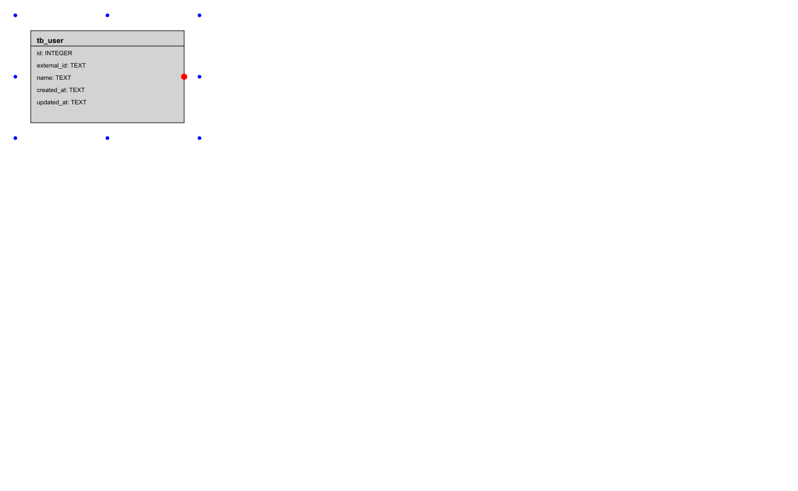

// /templates/readme.template.ts
<%# Nome do micro-serviço %>
# Repositório do micro-serviço cli-test


<%# Nome do banco gerado %>
## cli-test Database

Este documento descreve a estrutura do banco de dados e os passos para sua criação, incluindo a definição das tabelas, colunas, comentários, funções e triggers. A motivação para a criação deste documento é fornecer um guia detalhado para a configuração do banco de dados, garantindo que todas as etapas sejam seguidas corretamente para uma implementação consistente. Este documento também explica as vantagens de utilizar colunas como `external_id`, funções e triggers diretamente no banco de dados, comparado com a implementação no backend.

### Vantagens das Abordagens

**external_id**:
- Garantia de unicidade: Utilizar `external_id` como identificador único externo garante que cada registro possa ser identificado de forma única, mesmo em sistemas distribuídos.
- Facilidade de integração: `external_id` facilita a integração com outros sistemas e serviços que exigem identificadores únicos que não mudam.

**Funções e Triggers**:
- Consistência dos dados: Triggers garantem que certas regras de negócios sejam aplicadas consistentemente em todo o banco de dados.
- Redução de lógica no backend: Ao mover a lógica de verificação e restrições para o banco de dados, reduz-se a complexidade do código no backend.
- Melhoria da performance: Operações críticas podem ser otimizadas diretamente no banco de dados, evitando a necessidade de múltiplas consultas e verificações no backend.

### Dicionário de Dados

### Diagrama



<%# Conteúdo gerado para cada tabela %>
## Tabela `public.tb_user`

Tabela que armazena informações sobre user.

### Estrutura da Tabela

| Coluna | Tipo | Nulo | Comentário |
|---|---|---|---|
| id | serial4 | SIM | - |
| external_id | text | SIM | - |
| name | text | SIM | - |
| created_at | text | SIM | - |
| updated_at | text | SIM | - |

### Comentários das Colunas

- **id**: Sem comentário.
- **external_id**: Sem comentário.
- **name**: Sem comentário.
- **created_at**: Sem comentário.
- **updated_at**: Sem comentário.

---

## Como usar

### Via CLI

1. Instale as dependências:
   ```bash
   npm install
   ```
2. Inicie o projeto:
   ```bash
   npm start
   ```

### Via Docker

```bash
docker-compose up
```

### Swagger/API

A documentação estará disponível em `http://localhost:3000/swagger`.
